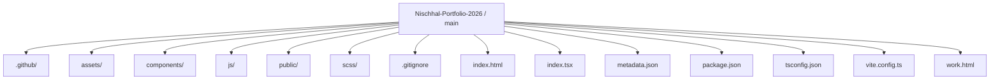
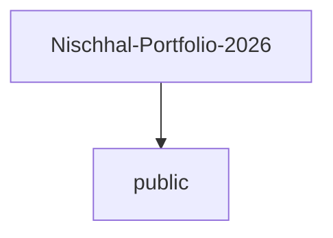
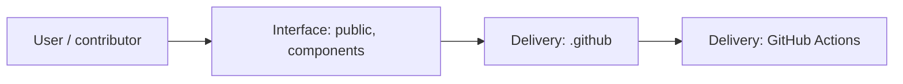
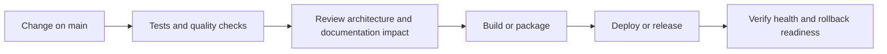
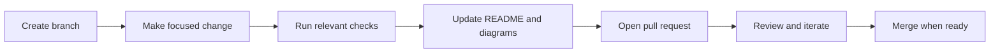

<!-- interactive-readme-standard:start -->

<div align="center">

# Nischhal-Portfolio-2026

**Branch-aware technical guide for [`main`](https://github.com/Nischhalsubba/Nischhal-Portfolio-2026/tree/main)**

<p>       </p>

<p>
  <a href="https://github.com/Nischhalsubba/Nischhal-Portfolio-2026/tree/main"><strong>Browse source</strong></a> ·
  <a href="https://github.com/Nischhalsubba/Nischhal-Portfolio-2026/issues"><strong>Issues</strong></a> ·
  <a href="https://github.com/Nischhalsubba/Nischhal-Portfolio-2026/codespaces/new?ref=main"><strong>Open in Codespaces</strong></a>
</p>

</div>

> [!IMPORTANT]
> This guide is generated from the files actually present on `main`. It links to detected source paths, preserves project-authored notes, and avoids claiming components that were not found.

## At a glance

| Item | Detected value |
|---|---|
| Purpose | A cinematic static portfolio concept for product designer Nischhal Raj Subba, focused on product design, UX, digital products, and design-led frontend work. |
| Branch role | Default branch |
| Stack | Vite, TypeScript, Sass, JavaScript, HTML, CSS |
| Manifests | package.json |
| Prerequisites | Node.js |
| Delivery | GitHub Actions |
| License | No license file detected |

## Branch scope

This is the repository's default branch.


## Quick start

```bash
npm install
npm run dev
npm run build
npm run preview
```

### Configuration surface

- No committed environment example file was detected.

> Never commit secrets, private keys, production credentials, customer data, or unredacted infrastructure details.

## Repository map



| Responsibility | Detected source paths |
|---|---|
| Interface | [`public`](https://github.com/Nischhalsubba/Nischhal-Portfolio-2026/tree/main/public), [`components`](https://github.com/Nischhalsubba/Nischhal-Portfolio-2026/tree/main/components) |
| Delivery | [`.github`](https://github.com/Nischhalsubba/Nischhal-Portfolio-2026/tree/main/.github) |

## Website or application map



## Architecture and responsibility flow




## Quality, security, and operations

<table>
<tr>
<td width="33%" valign="top">

### Quality

- No conventional test directory was detected automatically.

Detected commands:
- `npm run dev`
- `npm run build`
- `npm run preview`

</td>
<td width="33%" valign="top">

### Security

- No dedicated security policy or automated dependency configuration was detected.

Review authentication, authorization, input validation, dependency updates, secret handling, and failure recovery before release.

</td>
<td width="34%" valign="top">

### Observability

- No dedicated observability integration was detected automatically.

Define useful logs, metrics, traces, alerts, and rollback signals for production-facing branches.

</td>
</tr>
</table>

## Delivery flow



### Automation detected

- [`.github/workflows/apply-interactive-readme.yml`](https://github.com/Nischhalsubba/Nischhal-Portfolio-2026/blob/main/.github/workflows/apply-interactive-readme.yml)

## Contribution flow



- Keep changes focused and explain architectural consequences.
- Run the checks relevant to the changed area.
- Update diagrams whenever routes, modules, data models, authentication, jobs, or delivery paths change.
- Add screenshots or recordings for visual behavior changes when useful.
- Use issues for reproducible defects and pull requests for reviewable changes.

## Ownership and support

| Topic | Source |
|---|---|
| Repository | [`Nischhalsubba/Nischhal-Portfolio-2026`](https://github.com/Nischhalsubba/Nischhal-Portfolio-2026) |
| Branch | [`main`](https://github.com/Nischhalsubba/Nischhal-Portfolio-2026/tree/main) |
| Ownership | No CODEOWNERS file detected |
| Contributing | Use the contribution flow above |
| Support | [Open or review issues](https://github.com/Nischhalsubba/Nischhal-Portfolio-2026/issues) |
| License | No license file detected |

<details>
<summary><strong>Documentation maintenance checklist</strong></summary>

- [ ] Purpose and branch scope are accurate.
- [ ] Setup and configuration commands still work.
- [ ] Repository, application, API, data, authentication, job, and deployment diagrams match the code.
- [ ] Tests, security controls, observability, and rollback behavior are documented.
- [ ] Links point to real files on this branch.
- [ ] No secrets or private operational details are exposed.

</details>

<!-- interactive-readme-standard:end -->

<!-- project-authored-notes:start -->
<details>
<summary><strong>Project-authored notes preserved from this branch</strong></summary>

# Nischhal Portfolio 2026

> A cinematic, dark-theme personal portfolio concept for **Nischhal Raj Subba** — designed from a product designer's point of view and implemented as a lightweight static front-end experience.

[](https://vitejs.dev/)
[](https://www.typescriptlang.org/)
[](https://gsap.com/)
[](#tech-stack)

---

## Table of Contents

- [Overview](#overview)
- [Project Intent](#project-intent)
- [Designer's Perspective](#designers-perspective)
- [Current Status](#current-status)
- [Experience Summary](#experience-summary)
- [Feature Breakdown](#feature-breakdown)
- [Tech Stack](#tech-stack)
- [Repository Structure](#repository-structure)
- [Design System Notes](#design-system-notes)
- [Motion and Interaction System](#motion-and-interaction-system)
- [Responsive Design Notes](#responsive-design-notes)
- [Accessibility Notes](#accessibility-notes)
- [Content Integrity Notes](#content-integrity-notes)
- [Getting Started](#getting-started)
- [Available Scripts](#available-scripts)
- [Deployment](#deployment)
- [Recommended Improvements](#recommended-improvements)
- [Design QA Checklist](#design-qa-checklist)
- [Developer Notes](#developer-notes)
- [Maintainer](#maintainer)
- [License and Usage](#license-and-usage)

---

## Overview

**Nischhal Portfolio 2026** is a personal portfolio direction built around a premium, editorial, motion-heavy presentation style. The repository currently contains a static front-end portfolio landing page using **Vite**, **custom CSS**, **vanilla JavaScript**, and **GSAP / ScrollTrigger** loaded through CDN scripts.

The project is positioned around Nischhal Raj Subba's work as a product designer with interest in product design, website design, fintech, finance, banking, crypto, Web3, branding, and strategy. The current experience is not a simple resume page. It is closer to a designer-studio landing page where layout, typography, scroll rhythm, cursor behavior, and storytelling are used together to create a memorable first impression.

The visual direction is dark, cinematic, high-contrast, editorial, and portfolio-focused. The codebase is intentionally lightweight: static HTML, handcrafted CSS, and a small layer of JavaScript for cursor movement and animation behavior.

---

## Project Intent

The main goal of this repository is to create a strong personal portfolio foundation for 2026.

Instead of presenting work through a plain card grid or a typical portfolio template, this project explores a more expressive direction:

- large display typography
- strong dark background treatment
- product-design positioning
- scroll-based storytelling
- fixed/pinned project presentation
- editorial spacing
- animated marquees
- custom cursor behavior
- polished hover states
- designer-led content hierarchy

From a product-design perspective, the portfolio is trying to answer a simple question:

> How can a designer communicate taste, UX thinking, visual craft, motion sensitivity, and front-end awareness before the visitor even opens a case study?

The answer in this codebase is a portfolio that behaves more like an experience than a document. It uses spacing, rhythm, typography, and controlled motion to show the designer's taste and attention to interaction quality.

---

## Designer's Perspective

This repository is written and structured from the mindset of a designer who understands enough front-end code to shape the final experience.

That means the project does not only care about whether the page works. It also cares about:

- whether the first screen has enough impact
- whether the visual hierarchy is clear
- whether typography feels confident
- whether motion supports the story
- whether the interaction feels premium instead of noisy
- whether the page gives recruiters, clients, and collaborators a strong signal of craft
- whether the structure is simple enough to be maintained and improved later

The implementation uses straightforward front-end patterns so the design can stay close to the code. There is no heavy framework layer, no complex state management, and no unnecessary abstraction. This makes the project easy to inspect, easy to change, and suitable for a personal portfolio where visual quality matters more than application complexity.

---

## Current Status

The repository currently represents a **portfolio landing page concept / work-in-progress front-end shell**.

It includes:

- a main `index.html` landing page
- custom styling in `assets/styles.css`
- cursor behavior in `assets/main.js`
- GSAP animation logic in `assets/animations.js`
- Vite project scripts in `package.json`
- TypeScript configuration for future maintainability
- local assets and external placeholder images

The current page includes navigation references to:

- `about.html`
- `work.html`

At the time of this README update, those links should be treated as part of the intended navigation direction. If the pages are not yet created, they should be added before public deployment or the links should be adjusted to avoid broken navigation.

---

## Experience Summary

The landing page is structured as a long-form portfolio experience. Each section has a specific purpose in the overall story.

| Section | Role in the Experience | Design Purpose |
|---|---|---|
| Fixed Header | Provides identity, social links, navigation, and contact entry point | Keeps the portfolio feeling studio-like and always accessible |
| Hero | Introduces Nischhal and positions the work around finance, fintech, banking, crypto, and Web3 | Creates the first emotional impression |
| Hero Keyword Slider | Rotates words such as Banking, Crypto, Fintech, and Web3 | Makes the positioning feel active and specialized |
| Scope List | Shows services such as website design, product design, and branding strategy | Helps visitors quickly understand capability areas |
| Intro Section | Explains the design philosophy and industry direction | Gives meaning beyond visual style |
| Company / Logo Area | Intended for credibility or industry marks | Adds social proof once real logos are added |
| Awards Area | Intended for recognition-style proof | Needs verified content before public use |
| Angled Marquee | Adds energy and brand motion between sections | Breaks the page rhythm and reinforces expertise tags |
| Project Showcase | Presents selected work with sticky/pinned storytelling | Turns case studies into a guided experience |
| Testimonials | Adds human validation and trust | Needs real approved testimonials before public use |
| Footer CTA | Encourages contact and collaboration | Ends the experience with a clear conversion point |

---

## Feature Breakdown

### 1. Cinematic Dark Hero

The hero section uses a full-screen background image with dark overlay behavior. The tone is cinematic and direct. The page opens with a large typographic statement: design for finance-related industries.

The hero is built with:

- fixed background image behavior
- large uppercase display typography
- orange accent keyword slider
- scoped service list
- short designer introduction
- award/logo area

This gives the visitor an immediate sense of design direction before they read any long explanation.

### 2. Vertical Keyword Slider

The hero headline contains a vertical sliding keyword area. The visible words include:

- Banking
- Crypto
- Fintech
- Web3

This interaction is handled primarily through CSS animation. From a design point of view, it helps the hero feel alive without requiring the visitor to interact. It also keeps the positioning focused around industries that matter to the portfolio.

### 3. Custom Cursor Layer

The project includes a custom cursor dot and cursor circle. The cursor creates a slight lag/water-like effect using interpolation in JavaScript. It is meant to give the portfolio a premium, tactile feel on desktop.

The implementation respects two important conditions:

- if the user prefers reduced motion, the cursor is disabled
- if the device is touch-based, the custom cursor is disabled

This is a strong direction because cursor effects can feel impressive on desktop but awkward or inaccessible on mobile and touch devices.

### 4. Intro Text Reveal

The intro section uses a blur-to-clear word reveal animation. The text is split into individual words and animated with GSAP as the section scrolls into view.

This creates a controlled reading moment. Instead of throwing a block of text onto the page, the animation gradually brings the statement into focus.

From a UX perspective, this should be used carefully. It works best when the text is short, meaningful, and readable even if animation fails.

### 5. Angled Marquee System

The portfolio includes two large angled marquee rows. They use contrasting surfaces:

- black row
- orange row

The marquee communicates expertise areas such as:

- Strategy
- Product Design
- Fintech
- Web3
- Banking

The motion and rotation give the page a more expressive, brand-led feel. This section is less about detailed information and more about pace, personality, and visual energy.

### 6. Pinned Project Showcase

The project section is one of the most important parts of the experience. It uses a tall scroll area with a sticky inner layout on desktop. As the user scrolls, the project data changes between selected projects.

Current project items in the JavaScript data include:

- BitMEX
- Defichain
- GoTyme

The section updates:

- project title
- project image
- project year
- project role
- project description
- active index

This creates a guided case-study preview instead of a normal grid. It is a strong direction for a designer portfolio because it lets each project breathe.

### 7. Testimonial Rows

The testimonial section uses large rows with hover-aware image behavior. On hover, the number fades and the avatar appears.

This section is visually effective, but the current testimonial names and quotes must be treated carefully. The content should only be used publicly if the testimonials are real, approved, and accurately attributed.

### 8. Gradient Footer CTA

The footer uses a strong orange gradient and a large email marquee. This creates a memorable ending and gives the page a clear conversion point.

The footer currently includes:

- social links
- contact links
- project CTA
- personal design philosophy
- large email marquee
- copyright/location line

This is a good structure for a personal portfolio because it closes the story and gives visitors a simple next action.

---

## Tech Stack

| Layer | Technology | Current Usage |
|---|---|---|
| Build Tool | Vite | Used for local development, production build, and preview |
| Language Setup | TypeScript | Configured as project tooling, though current interaction files are JavaScript |
| Markup | HTML | Main landing page structure lives in `index.html` |
| Styling | Custom CSS | Main visual system lives in `assets/styles.css` |
| Motion | GSAP + ScrollTrigger | Loaded via CDN and used in `assets/animations.js` |
| Interactions | Vanilla JavaScript | Cursor logic and DOM-ready behavior live in `assets/main.js` |
| Fonts | Google Fonts | Manrope and Oswald are imported in CSS |
| Hosting Fit | Static hosting | Suitable for Vercel, Netlify, Cloudflare Pages, GitHub Pages, or any static host |

### Important Technical Note

The `package.json` includes Vite and TypeScript as development dependencies. Runtime animation libraries are currently loaded through CDN scripts inside `index.html`, not installed through npm dependencies.

That means the project can be run locally through Vite while still keeping the front-end structure simple and static.

---

## Repository Structure

```text
.
├── assets/
│   ├── animations.js       # GSAP and ScrollTrigger animation behavior
│   ├── main.js             # Cursor behavior and basic DOM-ready interaction logic
│   ├── styles.css          # Main design system, layout, typography, responsive CSS
│   ├── hero-portrait.jpg   # Hero visual asset
│   ├── asterisk.svg        # Rotating marquee icon asset
│   └── awards/             # Award/logo SVG assets used in the hero/intro areas
│
├── index.html              # Main landing page markup
├── package.json            # Vite scripts and project metadata
├── tsconfig.json           # TypeScript configuration
└── README.md               # Project documentation
```

---

## Design System Notes

The design system is intentionally small and handcrafted. It does not use Tailwind, Bootstrap, or a component library. The page relies on custom CSS variables, utility classes, and section-specific styling.

### Core Color Tokens

The root CSS variables define the main visual palette:

| Token | Value | Purpose |
|---|---:|---|
| `--bg-body` | `#0C0D10` | Main page background |
| `--bg-surface` | `#111111` | Secondary dark surface |
| `--text-main` | `#FFFFFF` | Primary text |
| `--text-muted` | `#888888` | Secondary text |
| `--text-disable` | `#444444` | Disabled or low-emphasis text |
| `--accent-orange` | `#FF5500` | Primary accent color |

The palette is simple and effective. The dark base gives the portfolio a premium tone, while the orange accent provides strong energy and direction.

### Typography

The project imports two Google Fonts:

| Font | Usage |
|---|---|
| Oswald | Display headings, uppercase labels, large typographic moments |
| Manrope | Body copy, supporting text, interface labels |

This combination gives the page a strong editorial personality. Oswald creates impact and vertical compression, while Manrope keeps body text more readable and modern.

### Layout System

The desktop layout uses a 16-column CSS grid through the `.grid` utility class.

```css
.grid {
  display: grid;
  grid-template-columns: repeat(16, 1fr);
  gap: 1rem;
}
```

This grid gives the design a structured editorial feel. It allows elements to sit in asymmetrical positions while still feeling controlled.

On smaller screens, the grid changes to a stacked flex layout. This keeps the page manageable on tablets and mobile devices.

### Visual Rhythm

The page uses:

- large vertical spacing
- full-screen hero composition
- long scroll sections
- oversized headings
- thin divider lines
- muted metadata labels
- strong contrast between quiet text and expressive motion

This rhythm makes the site feel closer to a premium design studio portfolio than a basic personal resume page.

---

## Motion and Interaction System

Motion is a core part of this portfolio. It is not only decoration. It is used to guide attention and create pacing.

### Motion Layers

| Motion Layer | File | Purpose |
|---|---|---|
| Cursor interpolation | `assets/main.js` | Creates a custom desktop cursor with lag effect |
| Hero scroll animation | `assets/animations.js` | Zooms the hero image and fades overlay during scroll |
| Intro text reveal | `assets/animations.js` | Reveals words from blur to clear state |
| Marquee movement | `assets/animations.js` | Moves angled marquee rows based on scroll |
| Pinned project update | `assets/animations.js` | Changes project data while scrolling |
| Footer parallax | `assets/animations.js` | Moves large footer marquee during scroll |

### GSAP Usage

The project uses GSAP and ScrollTrigger for scroll-based animation behavior. The script is loaded in `index.html` through CDN links.

The animation file registers ScrollTrigger and defines separate animation blocks for:

1. hero scroll animation
2. blur text reveal
3. marquee scroll motion
4. desktop pinned project gallery
5. mobile/tablet fallback behavior
6. footer parallax
7. cursor movement using GSAP tweens

### Reduced Motion Consideration

The custom cursor logic checks `prefers-reduced-motion` and disables the custom cursor when reduced motion is requested.

This is a good starting point, but the rest of the GSAP animation system should also be expanded to fully respect reduced-motion preferences. A future improvement would be to wrap major scroll animations with a global reduced-motion condition.

---

## Responsive Design Notes

The CSS includes responsive behavior for tablets and mobile devices.

### Tablet and Smaller Screens

At `max-width: 992px`, the layout changes significantly:

- `.grid` becomes a stacked flex layout
- header center links are hidden
- hero scope and hero intro blocks are hidden for simplicity
- project sticky behavior is disabled
- project layout becomes stacked
- testimonial rows become more readable in a vertical layout
- footer layout stacks more naturally

This is a practical responsive strategy because the desktop design depends heavily on grid composition and sticky/pinned behavior. On mobile, forcing the same layout would likely create poor usability.

### Mobile Screens

At `max-width: 768px`, the CSS further simplifies:

- navigation menu links are hidden
- company/logo grid becomes two columns
- project image height is reduced
- footer bottom stacks vertically

### Responsive Design Recommendation

The current responsive foundation is good, but the project should still be tested manually across:

- 1440px desktop
- 1280px laptop
- 1024px tablet landscape
- 768px tablet portrait
- 430px mobile large
- 390px mobile standard
- 360px mobile small

Special attention should be given to:

- hero title wrapping
- header usability
- hidden navigation on mobile
- project image visibility
- footer marquee overflow
- custom cursor removal on touch devices

---

## Accessibility Notes

This portfolio is visually strong, but accessibility should be treated as a core part of the final polish.

### What Already Works Well

- Semantic sections are used throughout the page.
- The custom cursor is disabled for touch devices and reduced-motion users.
- The color palette has strong contrast in many key areas.
- The page uses real text instead of text baked into images.
- The responsive layout simplifies complex desktop interactions.

### What Needs Improvement

- Replace generic `alt` text like `Background` and `Avatar` with meaningful descriptions.
- Avoid relying only on hover states for important information.
- Add visible keyboard focus states for links and interactive elements.
- Ensure mobile navigation is implemented before launch.
- Add reduced-motion handling for GSAP scroll animations.
- Make sure all placeholder links are replaced with real destinations.
- Avoid using `cursor: none` globally if it causes usability issues for some users.
- Test the site with keyboard-only navigation.

### Accessibility Checklist

- [ ] All images have meaningful `alt` text.
- [ ] Decorative images use empty `alt=""` where appropriate.
- [ ] All links have real destinations.
- [ ] Keyboard focus states are visible.
- [ ] Navigation can be used without a mouse.
- [ ] Animation respects `prefers-reduced-motion`.
- [ ] Text contrast meets WCAG AA where possible.
- [ ] Hover-only interactions have non-hover alternatives.
- [ ] Footer contact links are real and accessible.

---

## Content Integrity Notes

This is important for a public portfolio.

Some current content appears to be placeholder, inspiration-stage, or not yet verified as final personal portfolio content. Before publishing this portfolio publicly, review and replace any content that does not accurately represent Nischhal's real work, real clients, real awards, or real testimonials.

### Content That Should Be Reviewed

- company logos and placeholder company names
- `#` social links
- placeholder email address
- award claims
- testimonial names and quotes
- project names and descriptions
- external placeholder images
- navigation links to pages that may not yet exist

### Why This Matters

A portfolio is a trust-building tool. Every claim should be accurate because recruiters, clients, collaborators, and technical reviewers may inspect both the live site and the repository.

A beautiful portfolio becomes stronger when the story is also truthful and verifiable.

---

## Getting Started

### Requirements

You need:

- Node.js
- npm

### Installation

Clone the repository:

```bash
git clone https://github.com/Nischhalsubba/Nischhal-Portfolio-2026.git
```

Move into the project folder:

```bash
cd Nischhal-Portfolio-2026
```

Install dependencies:

```bash
npm install
```

Start the local development server:

```bash
npm run dev
```

Build for production:

```bash
npm run build
```

Preview the production build locally:

```bash
npm run preview
```

---

## Available Scripts

| Command | Purpose |
|---|---|
| `npm run dev` | Starts the Vite development server |
| `npm run build` | Builds the static production output |
| `npm run preview` | Serves the production build locally for review |

---

## Deployment

This project can be deployed on most static hosting platforms.

Recommended platforms:

- Vercel
- Netlify
- Cloudflare Pages
- GitHub Pages

Typical deployment settings:

```text
Build command: npm run build
Output directory: dist
```

If deploying to GitHub Pages, make sure the base path and asset paths work correctly depending on whether the site is deployed to a custom domain or a repository subpath.

---

## Recommended Improvements

### High Priority

- Replace placeholder content with verified portfolio content.
- Add real social links.
- Add a real contact email.
- Create or remove `about.html` and `work.html` links.
- Replace placeholder project images with real case-study visuals.
- Add SEO meta tags.
- Add Open Graph preview tags.
- Add a favicon and app icons.
- Add meaningful image alt text.
- Improve reduced-motion behavior across all GSAP animations.

### Medium Priority

- Convert repeated sections into reusable partials if the site grows.
- Move GSAP CDN dependencies into npm if tighter dependency control is needed.
- Add a mobile menu if navigation should remain available on small screens.
- Add project detail pages.
- Add case-study route structure.
- Add `robots.txt` and `sitemap.xml`.
- Add 404 page for static hosting.

### Design Polish

- Audit spacing across all breakpoints.
- Tune typography for smaller screens.
- Reduce footer marquee size on narrow devices if needed.
- Add smoother hover transitions to project and contact links.
- Replace generic placeholder visuals with consistent art direction.
- Confirm that orange accent usage remains intentional and not overused.

---

## Design QA Checklist

Before publishing this portfolio, review the following:

### Visual QA

- [ ] Hero image is high quality and optimized.
- [ ] Hero text does not collide with other elements.
- [ ] Header remains readable over the hero.
- [ ] Orange accent is used consistently.
- [ ] Typography scale feels balanced across breakpoints.
- [ ] Project section does not feel broken on mobile.
- [ ] Footer CTA remains readable and not overly compressed.

### Content QA

- [ ] All claims are accurate.
- [ ] All testimonials are real and approved.
- [ ] All client/company references are safe to show publicly.
- [ ] All links go to the correct destination.
- [ ] Placeholder images are removed.
- [ ] Email and contact information are correct.

### Technical QA

- [ ] `npm install` works.
- [ ] `npm run dev` works.
- [ ] `npm run build` works.
- [ ] Production preview works.
- [ ] No console errors appear on load.
- [ ] GSAP animations do not break the layout.
- [ ] Mobile/touch devices do not show the custom cursor.
- [ ] Reduced-motion preference is respected.

---

## Developer Notes

### Why the Codebase is Simple

This portfolio is currently built as a static front-end project because the content and interaction model do not require a complex application stack. For a personal portfolio, this is a smart direction because it keeps the site:

- fast
- easy to deploy
- easy to inspect
- easy to maintain
- easy to redesign
- independent from backend complexity

### Current JavaScript Approach

The JavaScript is split into two main files:

- `main.js` for cursor and general page interaction setup
- `animations.js` for GSAP and ScrollTrigger behavior

This separation is useful because cursor behavior and scroll animation behavior can evolve independently.

### Current CSS Approach

The CSS is centralized in `assets/styles.css`. This is easy for a smaller static portfolio, but if the site grows into multiple pages, the CSS could be split into:

```text
assets/css/
├── base.css
├── tokens.css
├── typography.css
├── layout.css
├── components.css
├── sections.css
└── responsive.css
```

That is not required immediately, but it may improve maintainability as the project expands.

---

## Future Documentation Ideas

If this portfolio becomes a larger public case-study project, the repository can include a `/docs` folder:

```text
docs/
├── DESIGN_DIRECTION.md
├── CONTENT_STRATEGY.md
├── MOTION_SYSTEM.md
├── ACCESSIBILITY_AUDIT.md
├── DEPLOYMENT_GUIDE.md
└── QA_CHECKLIST.md
```

This keeps the README focused while still allowing deeper documentation for design thinking, interaction decisions, and implementation notes.

---

## Maintainer

**Nischhal Raj Subba**  
Product Designer based in Nepal  
GitHub: [@Nischhalsubba](https://github.com/Nischhalsubba)

---

## License and Usage

This repository is intended for personal portfolio, learning, and demonstration purposes.

The design direction, visual identity, copy, and assets should not be reused or redistributed without permission from the maintainer. If you use this repository as inspiration, create your own visual language, content, structure, and portfolio story.

</details>
<!-- project-authored-notes:end -->
